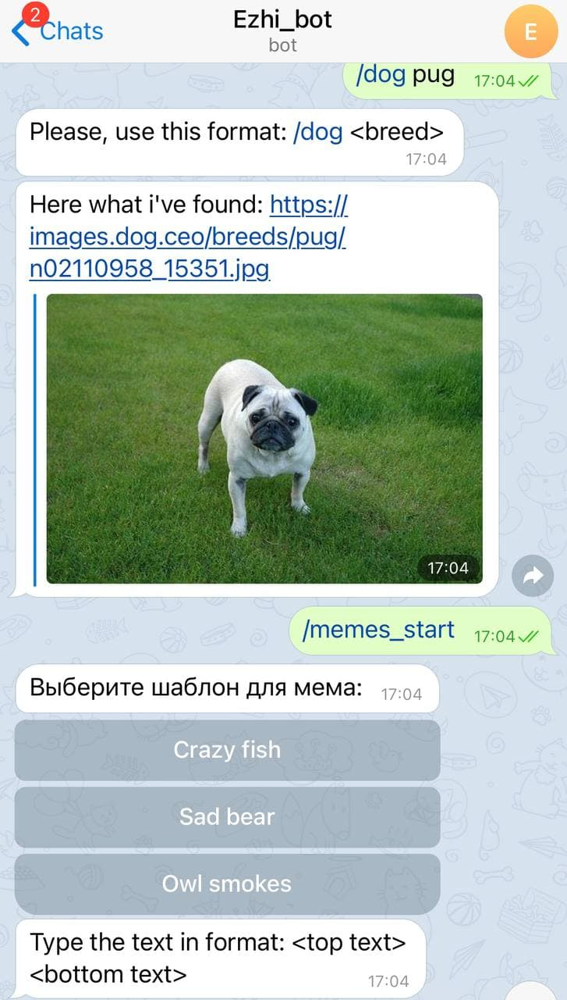
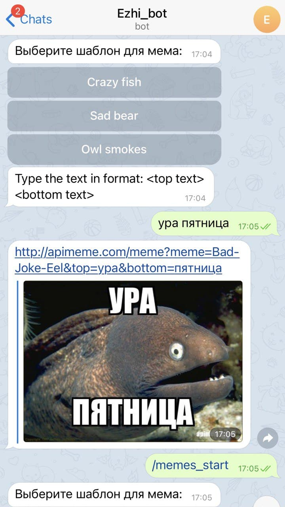

# Шуточный Телеграм Бот 
Реализован для отработки навыков взаимодействия с внешними API: Цитаты Чака Норриса, API с картинками собак, API для генерации пользовательских мемов.

## Команды для бота

1. /chuck  - прислать рандомную шутку о Чаке Норрисе
2. /dog <breed> - прислать картинку собаки породы <breed>
3. /breeds - показать список доступных пород
4. /memes_start - показать варианты шаблонов для создания мема. Далее пользователь может ввести любой текст и после отправки Бот пришлет готовую картинку.
 
<p align="center">
  
  
</p>

## Запуск

```bash
npm start
```
Далее  необходимо перейти в Telegram и вбить в поисковике @EzhiElya_bot. Проваливаемся в диалог и бот сразу запускается.


